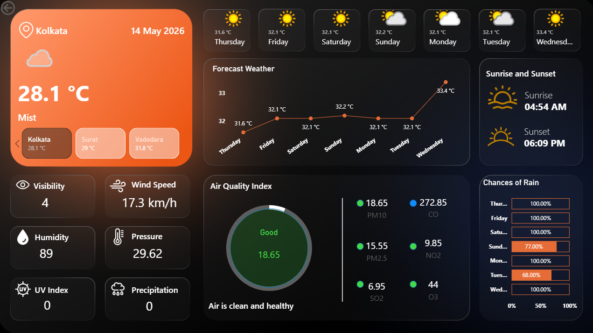
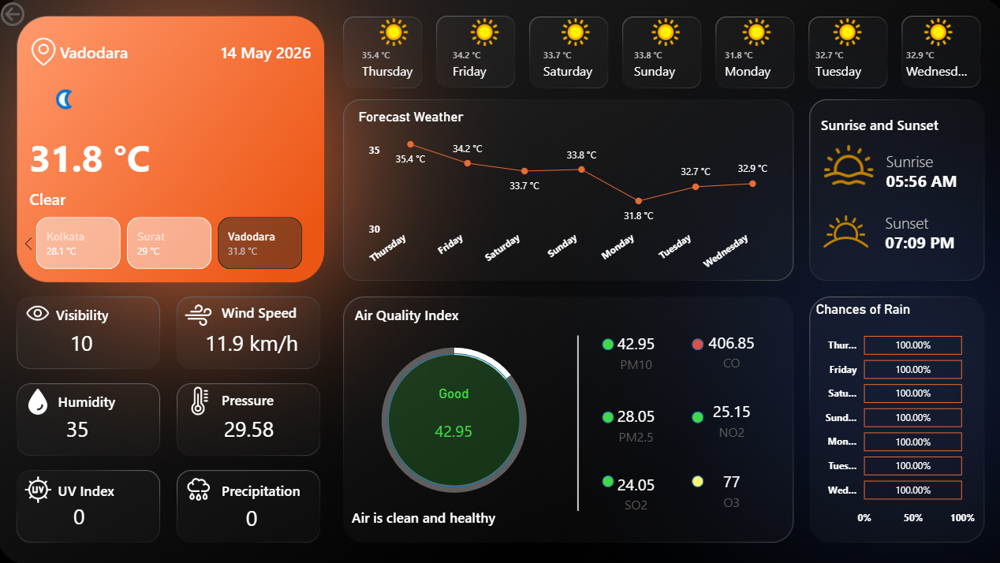

# 🌦️ Weather Dashboard using Power BI & WeatherAPI

## 📌 Project Overview
This project is an interactive **Weather Dashboard** built using **Microsoft Power BI** integrated with **WeatherAPI** for real-time weather data fetching.

The dashboard allows users to select city and instantly view detailed weather insights including temperature, humidity, wind speed, and forecast-related analytics.

The main objective of this project was to combine **real-time API integration** with **interactive data visualization** to create an intuitive and user-friendly weather analytics solution.

---

## 🚀 Features

- 🌍 **City Selection Filter**
  Users can dynamically select city to fetch weather details.

- ⛅ **Real-Time Weather Data**
  Integrated with WeatherAPI to get live weather information.

- 💨 **Weather Metrics**
  - Humidity
  - Wind Speed
  - Pressure
  - Visibility
  - UV Index

- 📊 **Interactive Visualizations**
  - KPI Cards
  - Line Charts
  - Bar Graphs
  - Weather Condition Indicators

---

## 🛠️ Tech Stack

| Technology | Purpose |
|------------|----------|
| Microsoft Power BI | Dashboard Development & Visualization |
| WeatherAPI | Real-Time Weather Data Fetching |
| Power Query | Data Transformation |
| DAX | Calculated Measures & KPIs |

---

## 📂 Data Source

Weather data is fetched from:

- Website: https://www.weatherapi.com/

API provides:
- Current Weather
- Forecast Data
- Air Quality Information
- Weather Conditions

---

## 📸 Dashboard Preview



---

## ⚙️ How It Works

1. User selects a city from the filter.
2. Real-time weather data is fetched.
3. Data is transformed using Power Query.
4. Dashboard visuals update dynamically.

---

## 📈 Key Insights Displayed

- Current weather condition of selected city
- Temperature comparison
- Wind & humidity analysis
- Visibility and pressure metrics
- Weather trend visualization

---

## 🔑 API Integration

The WeatherAPI endpoint was connected inside Power BI using **Web Data Source** and transformed using **Power Query Editor**.

### Sample API Format

```bash
http://api.weatherapi.com/v1/current.json?key=YOUR_API_KEY&q=Indore
```

---

## 📚 Learning Outcomes

Through this project, I learned:

- API integration in Power BI
- Data transformation using Power Query
- Creating interactive visualizations
- Building dynamic reports with filters and slicers

---

If you liked this project, feel free to ⭐ the repository.